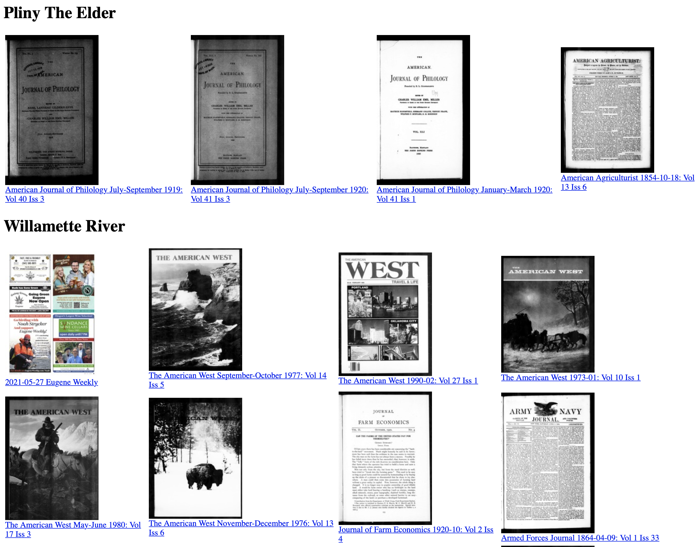

# TIARA    [![Badge License]][License]

*The Internet Archive Research Assistant*

<br>

<div align = center>

---

[![Button Archive]][Internet Archive]   
[![Button Bugs]][Bugs]   
[![Button Donate]][Donate]

---

<br>


    
</div>

<br>

A tool to search the **[Internet Archive]** <br>
for new items matching your keyword <br>
search-list.

Can be run with **[CronTab]** for daily <br>
updates about new items, relevant <br>
to your ongoing research.

It keeps track of the items you have <br>
discovered in the past and will only <br>
alert you to ones new to you.

Findings are placed in an **HTML** file, <br>
which can be send as an email via <br>
**[SendGrid]** to you automatically.

<br>
<br>
<br>

## Usage

Simply place your keywords / phrases into [`/Source/searchlist.txt`][SearchList] .

### Example

```txt
Pliny The Elder
Willamette River
Atari 1200XL computer
...
```

### Note

*Try not to use generic terms like `dogs` ,* <br>
*as this will return too many daily hits.*

<br>
<br>

##  Requirements

- The script requires read / write access to it's directory

- **[Internet Archive Command Line Tool][IACLT]**

    ```sh
    pip3 install internetarchive
    ```
    
<br>


<!----------------------------------------------------------------------------->

[Internet Archive]: https://archive.org/
[SendGrid]: https://sendgrid.com/
[CronTab]: https://github.com/cronie-crond/cronie
[Twitter]: https://twitter.com/kaysavetz
[Donate]: https://archive.org/donate/
[IACLT]: https://github.com/jjjake/internetarchive

[SearchList]: Source/searchlist.txt
[License]: LICENSE
[Bugs]: Documentation/Bugs.md

<!--------------------------------{ Badges }----------------------------------->

[Badge License]: https://img.shields.io/badge/License-MIT-yellow.svg?style=for-the-badge


<!-------------------------------{ Buttons }----------------------------------->

[Button Archive]: https://img.shields.io/badge/Internet_Archive-666666?style=for-the-badge&logo=InternetArchive&logoColor=white
[Button Donate]: https://img.shields.io/badge/Donate-yellow?style=for-the-badge&logo=InternetArchive&logoColor=white
[Button Bugs]: https://img.shields.io/badge/Bugs-6A5FBB?style=for-the-badge
